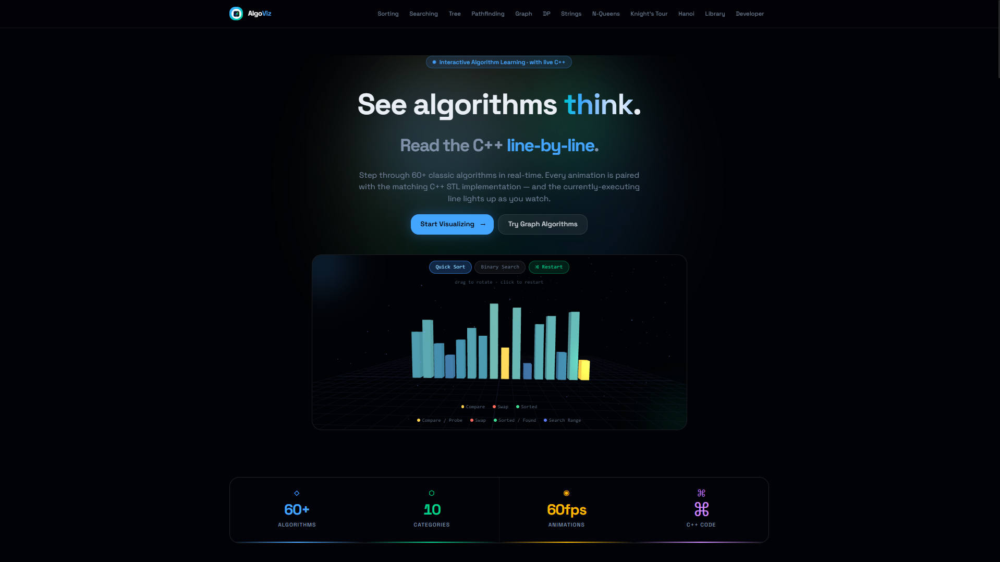

<div align="center">

# ⟨⟩ AlgoViz

### Interactive Algorithm Visualizer with C++ Source Code

**Visualize 65+ classic algorithms with smooth animations and line-by-line C++ STL source — from sorting and searching to graphs, dynamic programming, pathfinding, and beyond.**

[](https://react.dev)
[](https://www.typescriptlang.org)
[](https://tanstack.com/router)
[](https://tailwindcss.com)
[](https://www.framer.com/motion/)
[](https://threejs.org)
[](https://vercel.com)

</div>

---

## 📸 Homepage Preview

<!-- Replace the src below with your actual screenshot path once captured -->



> _Homepage with the 2D Quick Sort / Binary Search hero, 3D A\* + graph scenes, algorithm cards, and dark premium UI._

---

## 📋 Table of Contents

- [Overview](#-overview)
- [What's New](#-whats-new)
- [Live Demo](#-live-demo)
- [Features](#-features)
- [Algorithm Coverage](#-algorithm-coverage)
  - [Visualizer Pages](#visualizer-pages)
  - [Algorithm Library](#algorithm-library-74-entries)
- [Project Structure](#-project-structure)
- [Tech Stack](#-tech-stack)
- [Getting Started](#-getting-started)
- [PWA Support](#-pwa-support)
- [Deployment](#-deployment)
- [Developer Page](#-developer-page)
- [Contributing](#-contributing)
- [Author](#-author)

---

## 🧠 Overview

**AlgoViz** is a premium, browser-based algorithm visualization platform built entirely in React + TypeScript. Every supported algorithm runs as a **step-by-step generator** — each state transition is rendered as a frame — so you can pause, rewind, and inspect exactly what's happening at every moment.

Alongside every visualization, a **live C++ code panel** highlights the exact line of source code executing at that step — tinted in the algorithm's own accent color, with a ▶ pointer and auto-scroll. This makes AlgoViz equally useful as a learning tool and a reference for competitive programming.

The homepage hero animates Quick Sort and Binary Search in crisp 2D (bars that reorder, a live binary-search probe), plus 3D scenes for A\* pathfinding and BFS/DFS graph traversal — all running client-side with zero dependencies on backend compute.

---

## 🆕 What's New

- **2D hero** — Quick Sort and Binary Search moved from WebGL to crisp 2D; sort bars now physically reorder, with value labels on top and a scrubbable timeline. A\* stays 3D.
- **Executing-line highlight** — code panel tints the running line in the algorithm's accent color (`color-mix`), with a ▶ pointer and auto-scroll.
- **Redesigned navigation** — compact bar + "Explore all" mega-menu grouped by category (no more long link row).
- **Themed dropdowns** — `ThemedSelect` replaces native OS-white menus on Hanoi / N-Queens / Knight's Tour.
- **Responsive + overlap fixes** — Tower of Hanoi peg labels no longer overlap; layout holds down to mobile widths.
- **5 new algorithms** — Pancake Sort, Odd-Even Sort, Fibonacci Search, Longest Palindromic Substring, Subset Sum.
- **Keyboard controls** — Space play/pause, ← / → step, R reset; `prefers-reduced-motion` respected.

---

## 🔗 Live Demo

> _Deploy your own or update this link after hosting._

```
https://your-algviz-deployment.vercel.app
```

---

## ✨ Features

### Core Visualizer Experience

- **Step-by-step playback** — each algorithm emits discrete state frames via JavaScript generators; nothing is pre-baked
- **Playback controls** — Play, Pause, Step Forward, Step Backward, Reset, with adjustable speed slider
- **Live C++ code panel** — syntax-highlighted C++ STL source; the executing line is highlighted with a per-algorithm accent tint (via `color-mix`), a ▶ pointer, and auto-scroll into view
- **Copy & Download** — copy C++ source to clipboard or download it as a `.cpp` file directly from the code panel
- **Per-algorithm accent colors** — each algorithm variant has its own OKLCH color for bar/node highlighting
- **Smooth animations** — Framer Motion powers all transitions, bar height changes, node traversals, and page entries

### Homepage

- **2D hero** — animated Quick Sort (bars physically reorder, compare/swap glow, live value labels on top of each bar) and Binary Search (sliding lo/hi bracket, mid-probe pointer, target outline), toggleable, with a scrubbable + pausable timeline and mode-aware legend
- **3D A\* pathfinding scene** — WebGL grid showing A\* search open/closed/path cells (kept in Three.js)
- **3D BFS/DFS graph widget** — 14-node 3D graph with orbiting camera, edge highlights, and traversal order replay (`GraphTraversal3D.tsx`)
- **Algorithm category cards** — all 12 visualizer sections displayed with icons and descriptions
- **Full-page scroll animations** — Framer Motion `useScroll` + `useTransform` parallax

### Navigation

- Sticky frosted-glass header with blur backdrop (`oklch(0.08 0.02 265 / 88%)`)
- Compact desktop bar (logo + quick links) plus an **"Explore all" mega-menu** grouping every section into Core / Graphs & Trees / Backtracking / More — each with icon and description
- Grouped responsive mobile drawer; active route highlighted with a color-matched accent
- Closes on outside-click and Escape

### Controls & dropdowns

- **Keyboard shortcuts** — Space play/pause, ← / → step, R reset
- **Themed dropdowns** — custom on-brand select (`ThemedSelect`) replaces native OS-white menus on Hanoi, N-Queens, and Knight's Tour; popup matches each page's accent color

### Design System

- **Pure dark theme** — background `oklch(0.08 0.02 265)`, consistent across all routes
- **OKLCH color system** — perceptually uniform colors for all chart highlights and UI accents
- **Tailwind CSS v4** — utility-first, no CSS-in-JS overhead
- **shadcn/ui components** — full set of Radix UI primitives (dialog, tooltip, select, slider, etc.)
- **PWA ready** — `manifest.webmanifest`, `apple-touch-icon`, 192/512 icons, installable on mobile

---

## 📐 Algorithm Coverage

### Visualizer Pages

Each page has a selector to switch between algorithms, randomize/reset input, and adjust speed. All pages share the same `Controls` component and `usePlayer` hook for consistent playback behavior.

---

#### ⟨⟩ Sorting — `/sorting`

Bar chart visualization. Compare (blue), swap (accent), sorted (green) color states.

| Algorithm      | Time Complexity | Notes                    |
| -------------- | --------------- | ------------------------ |
| Bubble Sort    | O(n²)           | Classic adjacent-swap    |
| Selection Sort | O(n²)           | Min-finding per pass     |
| Insertion Sort | O(n²)           | Shift-left insertion     |
| Merge Sort     | O(n log n)      | Divide & conquer, stable |
| Quick Sort     | O(n log n) avg  | Pivot partition          |
| Heap Sort      | O(n log n)      | In-place, heapify        |
| Shell Sort     | O(n log²n)      | Gap-sequence insertion   |
| Counting Sort  | O(n + k)        | Non-comparison, integer keys |
| Radix Sort     | O(d·(n + k))    | Digit-by-digit            |
| Cocktail Sort  | O(n²)           | Bidirectional bubble      |
| Gnome Sort     | O(n²)           | Single-pointer back-swap  |
| Comb Sort      | O(n²/2ᵖ)        | Shrinking-gap bubble      |
| Cycle Sort     | O(n²)           | Minimal writes            |
| Pancake Sort   | O(n²)           | Prefix-flip sorting       |
| Odd-Even Sort  | O(n²)           | Brick sort, parallel-friendly |

---

#### ⌕ Searching — `/searching`

Array visualization. Checked (accent), eliminated (dimmed), found (green) states. Sorted algorithms auto-sort the array before running.

| Algorithm            | Time Complexity  | Requires Sorted |
| -------------------- | ---------------- | --------------- |
| Linear Search        | O(n)             | No              |
| Binary Search        | O(log n)         | Yes             |
| Jump Search          | O(√n)            | Yes             |
| Interpolation Search | O(log log n) avg | Yes             |
| Exponential Search   | O(log n)         | Yes             |
| Ternary Search       | O(log₃ n)        | Yes             |
| Fibonacci Search     | O(log n)         | Yes             |

---

#### ⋔ Tree Traversal — `/tree`

Animated BST rendering. Nodes highlighted as visited, path shown step by step.

| Algorithm       | Description                       |
| --------------- | --------------------------------- |
| BFS             | Level-order traversal using queue |
| DFS — Inorder   | Left → Root → Right               |
| DFS — Preorder  | Root → Left → Right               |
| DFS — Postorder | Left → Right → Root               |

---

#### ◈ Pathfinding — `/pathfinding`

18×32 interactive grid. Draw walls, drag start/end cells, run the algorithm, watch the frontier expand.

| Algorithm | Guarantees Shortest Path | Notes                          |
| --------- | ------------------------ | ------------------------------ |
| BFS       | Yes (unweighted)         | Explores all neighbors equally |
| Dijkstra  | Yes (weighted)           | Priority-queue frontier        |
| A\*       | Yes                      | Euclidean heuristic            |

---

#### ⬡ Graph Algorithms — `/graph`

Node-link diagram (SVG). Directed/undirected, weighted edges, animated edge traversal and node coloring.

| Algorithm        | Category                |
| ---------------- | ----------------------- |
| DFS              | Traversal               |
| BFS              | Traversal               |
| Topological Sort | Ordering                |
| Cycle Detection  | Structural              |
| Dijkstra         | Shortest Path           |
| Bellman-Ford     | Shortest Path           |
| Floyd-Warshall   | All-Pairs Shortest Path |
| Prim MST         | Minimum Spanning Tree   |
| Kruskal MST      | Minimum Spanning Tree   |

---

#### ⊞ Dynamic Programming — `/dp`

DP table visualization. Cells fill in real time as subproblems are solved; `highlightCell` and `highlightCells` show dependencies.

| Algorithm     | Description                           |
| ------------- | ------------------------------------- |
| Fibonacci     | 1D DP table, fib(n−1) + fib(n−2)      |
| LCS           | 2D table, longest common subsequence  |
| 0/1 Knapsack  | 2D table, weight/value optimization   |
| Edit Distance | 2D table, Levenshtein distance        |
| Coin Change   | 1D DP, minimum coins                  |
| LIS           | 1D DP, longest increasing subsequence |
| Subset Sum    | 2D boolean table, target reachability |

---

#### Σ String Algorithms — `/strings`

Text + pattern visualization. Characters highlighted as matched, mismatched, or skipped. Preset inputs available.

| Algorithm            | Time Complexity |
| -------------------- | --------------- |
| Naive Pattern Search | O(nm)           |
| KMP                  | O(n + m)        |
| Rabin-Karp           | O(n + m) avg    |
| Z-Algorithm          | O(n + m)        |
| Boyer-Moore          | O(n/m) avg      |
| Longest Palindrome   | O(n²)           |

---

#### ♛ N-Queens — `/nqueens`

Chessboard visualization of the backtracking N-Queens solver. Queens placed/removed frame by frame; conflicts shown in red.

---

#### ♞ Knight's Tour — `/knights`

Chessboard visualization using **Warnsdorff's heuristic**. Each knight move is animated step by step across the board.

---

#### ⌬ Tower of Hanoi — `/hanoi`

Three-peg animated Hanoi solver. Discs rendered as colored bars, physically moved between pegs with Framer Motion `AnimatePresence`.

---

### Algorithm Library — 74 Entries — `/library`

A searchable reference of 74 classic algorithms, each with:

- Clean **C++ STL implementation** with syntax highlighting
- **Time & space complexity**
- **How it works** — plain-language walkthrough
- **When to use** — bullet list of common use cases
- **Concrete example** — input → output → reasoning

Algorithms are organized into categories with color-coded badges. Use the search bar to filter by name or category.

| Category                | Algorithms                                                                                                                                                                                                                                                                                                      |
| ----------------------- | --------------------------------------------------------------------------------------------------------------------------------------------------------------------------------------------------------------------------------------------------------------------------------------------------------------- |
| **Strings**             | Boyer-Moore, Manacher, KMP, Aho-Corasick, Rabin-Karp, Z-Algorithm, Suffix Array, Trie                                                                                                                                                                                                                           |
| **Number Theory**       | Sieve of Eratosthenes, Linear Sieve (SPF), GCD, Fast Modular Exponentiation, Miller-Rabin, Pollard's Rho, Matrix Exponentiation, Linear Phi Sieve, nCr (Pascal)                                                                                                                                                 |
| **Dynamic Programming** | Matrix Chain Multiplication, Rod Cutting, Subset Sum, Unbounded Knapsack, LCS, LIS, Edit Distance, Coin Change, Catalan Numbers, Kadane's                                                                                                                                                                       |
| **Data Structures**     | Union-Find (DSU), Fenwick Tree (BIT), Segment Tree, Sparse Table (RMQ), Treap, LRU Cache, Monotonic Stack, Sliding Window Maximum, Min-Heap                                                                                                                                                                     |
| **Graphs**              | Kosaraju SCC, Tarjan SCC, Tarjan Bridges, Articulation Points, Bipartite Check, Hopcroft-Karp, Topological Sort (Kahn), Bellman-Ford, Floyd-Warshall, Dijkstra, Prim MST, Kruskal MST, BFS, DFS, Hierholzer (Eulerian Path), Edmonds-Karp Max Flow, LCA (Binary Lifting), Heavy-Light Decomposition, Euler Tour |
| **Trees**               | Morris Inorder Traversal                                                                                                                                                                                                                                                                                        |
| **Sorting / Selection** | Counting Sort, Radix Sort, Bucket Sort, QuickSelect (k-th), Reservoir Sampling, Boyer-Moore Majority Vote                                                                                                                                                                                                       |
| **Miscellaneous**       | Knapsack with Reconstruction, Convex Hull (Andrew's), Mo's Algorithm, Kahn Toposort + DP, Hash Map (Open Addressing), Two-Pointers, Floyd's Cycle Detection, Manhattan MST, Reservoir-weighted Sampling                                                                                                         |

---

## 🗂 Project Structure

```
algorithm-visualizer-main/
├── public/
│   ├── favicon.svg
│   ├── apple-touch-icon.png
│   ├── icon-192.png
│   ├── icon-512.png
│   ├── manifest.webmanifest          # PWA manifest
│   └── dev.png                       # Developer page photo
│
├── src/
│   ├── components/
│   │   ├── Nav.tsx                   # Sticky navbar with "Explore all" mega-menu + mobile drawer
│   │   ├── HeroViz2D.tsx             # 2D Quick Sort + Binary Search homepage hero
│   │   ├── ThemedSelect.tsx          # On-brand dropdown (replaces native OS select)
│   │   ├── PythonCodePanel.tsx       # C++ panel: accent-tinted executing line + auto-scroll
│   │   ├── GraphTraversal3D.tsx      # Three.js 3D BFS/DFS widget (homepage)
│   │   └── ui/                       # Full shadcn/ui component library (Radix UI primitives)
│   │       ├── accordion.tsx
│   │       ├── button.tsx
│   │       ├── dialog.tsx
│   │       ├── sidebar.tsx
│   │       ├── slider.tsx
│   │       └── ... (30+ components)
│   │   └── viz/
│   │       └── Controls.tsx          # Shared playback controls (Play/Pause/Step/Speed)
│   │
│   ├── hooks/
│   │   └── use-mobile.tsx            # Responsive breakpoint hook
│   │
│   ├── lib/
│   │   ├── algorithms/
│   │   │   ├── sorting.ts            # Bubble…Cycle, Pancake, Odd-Even (15 sorters)
│   │   │   ├── searching.ts          # Linear, Binary, Jump, Interpolation, Exponential, Ternary, Fibonacci
│   │   │   ├── graph.ts              # DFS, BFS, Topo, Dijkstra, Bellman-Ford, Floyd, Prim, Kruskal
│   │   │   ├── dp.ts                 # Fibonacci, LCS, Knapsack, Edit Distance, Coin Change, LIS, Subset Sum
│   │   │   ├── pathfinding.ts        # BFS, Dijkstra, A* on grid
│   │   │   ├── strings.ts            # Naive, KMP, Rabin-Karp, Z-Algo, Boyer-Moore, Longest Palindrome
│   │   │   ├── tree.ts               # BST build + BFS/DFS-In/Pre/Post traversals
│   │   │   ├── backtracking.ts       # N-Queens, Knight's Tour (Warnsdorff), Tower of Hanoi
│   │   │   ├── libraryData.ts        # 74-entry algorithm reference library (C++ + explanations)
│   │   │   ├── python.ts             # Legacy algorithm code snippets (back-compat)
│   │   │   └── lineMaps.ts           # Maps algorithm step → active line numbers for code panel
│   │   │
│   │   ├── api/
│   │   │   └── example.functions.ts  # TanStack Start server function example
│   │   ├── cppHighlight.ts           # Custom C++ tokenizer and syntax highlighter
│   │   ├── usePlayer.ts              # Shared generator playback hook (play/pause/step/speed)
│   │   ├── utils.ts                  # cn() utility (clsx + tailwind-merge)
│   │   ├── config.server.ts          # Server-side config
│   │   ├── error-capture.ts          # Error capturing utilities
│   │   └── error-page.ts             # Error page HTML generator
│   │
│   ├── routes/
│   │   ├── __root.tsx                # Root layout (Nav, Toaster, global styles)
│   │   ├── index.tsx                 # Homepage (2D hero, algorithm cards, 3D A* + graph scenes)
│   │   ├── sorting.tsx               # Sorting visualizer
│   │   ├── searching.tsx             # Searching visualizer
│   │   ├── tree.tsx                  # Tree traversal visualizer
│   │   ├── pathfinding.tsx           # Grid pathfinding visualizer
│   │   ├── graph.tsx                 # Graph algorithm visualizer
│   │   ├── dp.tsx                    # Dynamic programming table visualizer
│   │   ├── strings.tsx               # String matching visualizer
│   │   ├── nqueens.tsx               # N-Queens backtracking visualizer
│   │   ├── knights.tsx               # Knight's Tour visualizer
│   │   ├── hanoi.tsx                 # Tower of Hanoi visualizer
│   │   ├── library.tsx               # 74-algorithm searchable reference library
│   │   ├── developer.tsx             # Developer / about page
│   │   └── README.md                 # Routes-specific notes
│   │
│   ├── router.tsx                    # TanStack Router setup
│   ├── routeTree.gen.ts              # Auto-generated route tree
│   ├── server.ts                     # Nitro server entry
│   ├── start.ts                      # App entry point
│   └── styles.css                    # Global styles + Tailwind v4 theme (OKLCH design tokens)
│
├── .gitignore
├── .prettierrc
├── bunfig.toml                       # Bun package manager config
├── components.json                   # shadcn/ui CLI config
├── eslint.config.js
├── package.json
├── tsconfig.json
├── vercel.json                       # Vercel rewrite rules (SSR)
└── vite.config.ts                    # Vite + Nitro + TanStack config
```

---

## 🛠 Tech Stack

| Layer               | Technology             | Version   | Purpose                             |
| ------------------- | ---------------------- | --------- | ----------------------------------- |
| **Framework**       | React                  | 19        | UI rendering                        |
| **Language**        | TypeScript             | 5.8       | Type safety                         |
| **Routing**         | TanStack Router        | 1.x       | File-based, type-safe routing       |
| **Meta-framework**  | TanStack Start + Nitro | 1.x       | SSR-ready server layer              |
| **Build tool**      | Vite                   | 7.x       | Dev server & bundler                |
| **Styling**         | Tailwind CSS           | 4.x       | Utility-first CSS                   |
| **Animation**       | Framer Motion          | 12        | Declarative React animations        |
| **3D Graphics**     | Three.js               | r176      | A\* pathfinding + graph 3D scenes    |
| **UI Primitives**   | Radix UI / shadcn/ui   | latest    | Accessible, unstyled components     |
| **Icons**           | Lucide React           | 0.575     | Icon set                            |
| **Charts**          | Recharts               | 2.x       | (available, library infrastructure) |
| **Package Manager** | Bun / npm              | —         | Fast installs                       |
| **Deployment**      | Vercel                 | —         | Edge-ready SSR deployment           |
| **Linting**         | ESLint + Prettier      | 9.x / 3.x | Code quality                        |

---

## 🚀 Getting Started

### Prerequisites

- **Node.js** ≥ 18 or **Bun** ≥ 1.x
- Git

### Installation

```bash
# Clone the repository
git clone https://github.com/Hafiz-Sakib/algorithm-visualizer.git
cd algorithm-visualizer

# Install dependencies (with npm)
npm install

# Or with Bun (faster)
bun install
```

### Development Server

```bash
# npm
npm run dev

# Bun
bun run dev
```

Open [http://localhost:3000](http://localhost:3000) in your browser.

### Build for Production

```bash
npm run build
# or
bun run build
```

### Preview Production Build

```bash
npm run preview
# or
bun run preview
```

### Linting & Formatting

```bash
# Lint
npm run lint

# Format with Prettier
npm run format
```

---

## 📱 PWA Support

AlgoViz is installable as a Progressive Web App on both desktop and mobile.

The `public/manifest.webmanifest` provides:

- App name, short name, and description
- 192×192 and 512×512 icons
- `apple-touch-icon` for iOS home screen
- Standalone display mode (no browser chrome when installed)

On Chrome/Edge desktop or Android, use the "Install app" prompt in the address bar. On iOS Safari, use **Share → Add to Home Screen**.

---

## ☁️ Deployment

The project is configured for **Vercel** deployment with server-side rendering via Nitro.

`vercel.json` rewrites all routes to the Nitro handler:

```json
{
  "rewrites": [{ "source": "/(.*)", "destination": "/api/server" }]
}
```

### Deploy to Vercel

```bash
# Install Vercel CLI
npm i -g vercel

# Deploy
vercel --prod
```

Or connect your GitHub repository to [vercel.com](https://vercel.com) for automatic deployments on every push.

---

## 👨‍💻 Developer Page

The `/developer` route is a personal portfolio section for the project author, featuring:

- Animated skill bars (JavaScript, React, TypeScript, Node.js, DSA, and more)
- Bangladesh flag via `country-flag-icons`
- Project links (GitHub, portfolio, Codeforces, LeetCode)
- Framer Motion entrance animations

---

## 🤝 Contributing

Contributions are welcome! Here are some ways to help:

1. **Add a new algorithm** to an existing visualizer page (add the generator to the appropriate `src/lib/algorithms/*.ts` file, map its line numbers in `lineMaps.ts`, and register it in the page's algo selector)
2. **Add a Library entry** — add a new entry to `libraryData.ts` following the existing `entry()` pattern
3. **New visualizer page** — create a new route in `src/routes/`, add it to a group in `Nav.tsx`, and add a generator file
4. **Bug fixes** — open an issue or PR

### Steps

```bash
# Fork → clone → branch
git checkout -b feature/new-algorithm

# Make changes, then
git commit -m "feat: add Floyd-Warshall to graph visualizer"
git push origin feature/new-algorithm
# Open a Pull Request
```

---

## 📄 License

This project is open source. See `LICENSE` for details (if present), or contact the author.

---

## 👤 Author

**Mohammad Hafizur Rahman Sakib**

| Platform   | Link                                                      |
| ---------- | --------------------------------------------------------- |
| GitHub     | [@Hafiz-Sakib](https://github.com/Hafiz-Sakib)            |
| Portfolio  | [hafizsakib.vercel.app](https://hafizsakib.vercel.app)    |
| Codeforces | [hafiz_sakib](https://codeforces.com/profile/hafiz_sakib) |
| LeetCode   | [hafiz_sakib](https://leetcode.com/hafiz_sakib)           |
| Email      | hafizsakib5@gmail.com                                     |

---

<div align="center">

Made with ❤️ in Bangladesh 🇧🇩

**⟨⟩ AlgoViz** — Watch algorithms think.

</div>
